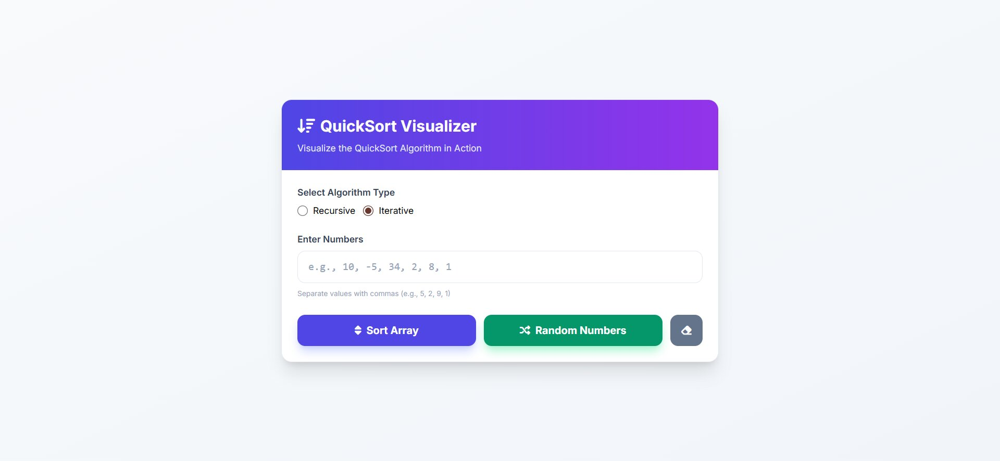

# QuickSort Engineering Lab

A high-performance QuickSort library with both recursive and iterative implementations, comprehensive testing, and a modern web-based visualizer. Developed as part of the ITI Scholarships Program - Vibe Coding and Working with APIs.


[Live Demo](https://quick-sort-visualizer-demo.netlify.app)

## 🚀 Features

- **Dual Implementation**: Both recursive and iterative QuickSort algorithms
- **In-Place Sorting**: Uses Lomuto partitioning scheme (O(log n) space complexity)
- **Input Validation**: Robust validation layer prevents execution on invalid data types
- **Web Visualizer**: Interactive UI built with Tailwind CSS
- **Comprehensive Tests**: Full Jest test suite covering edge cases and stress testing
- **Performance Benchmark**: Built-in benchmarking tools

## 📦 Installation

```bash
npm install
```

## 💻 Usage

### JavaScript/Node.js

```javascript
const { quickSort, quickSortIterative } = require('./quick-sort');

// Recursive QuickSort
const sorted1 = quickSort([3, 6, 8, 10, 1, 2, 1]);
console.log(sorted1); // [1, 1, 2, 3, 6, 8, 10]

// Iterative QuickSort
const sorted2 = quickSortIterative([3, 6, 8, 10, 1, 2, 1]);
console.log(sorted2); // [1, 1, 2, 3, 6, 8, 10]
```

### Web Visualizer

Open `index.html` in your browser:

```bash
# Using Windows
start index.html

# Using macOS
open index.html

# Using Linux
xdg-open index.html
```

Enter comma-separated numbers and click "Sort Array" to see the sorted results.

## 🧪 Testing

Run the test suite with Jest:

```bash
npm test
```

Expected output:

```
PASS  ./quick-sort.test.js
  ✓ should return an empty array when input is empty
  ✓ should return the same array for an array with one element
  ✓ should return the same array for an already sorted array
  ✓ should correctly sort a reverse-sorted array
  ✓ should correctly sort an array with duplicate elements
  ✓ should correctly sort a large array of random numbers
  ✓ should throw TypeError if input is not an array
  ✓ should throw TypeError if array contains invalid numeric types
```

## ⚡ Benchmarking

Run the benchmark script to compare performance:

```bash
node benchmark.js
```

Sample output:

```
--- Benchmarking Sort Algorithms (10000 elements) ---
quickSortIterative: 12.4500ms
Built-in .sort():   0.8200ms

Result: Built-in .sort() is approximately 15.18x faster than quickSortIterative.
```

## 📊 Performance & Complexity Analysis

| Metric                 | Recursive QuickSort   | Iterative QuickSort   | Built-in `.sort()` (Timsort) |
| :--------------------- | :-------------------- | :-------------------- | :--------------------------- |
| **Average Time**       | O(n log n)            | O(n log n)            | O(n log n)                   |
| **Worst Case**         | O(n²)                 | O(n²)                 | O(n log n)                   |
| **Space Complexity**   | O(log n) (Call Stack) | O(log n) (Heap Stack) | O(n)                         |
| **Stability**          | No                    | No                    | Yes                          |
| **Engine Performance** | Baseline              | ~1.1x Slower          | **15x - 20x Faster**         |

### Key Insights

While our custom QuickSort is algorithmically efficient, the JavaScript engine's native `.sort()` (Timsort) is vastly superior due to:

1. **Engine-level Optimization**: Implementation in highly optimized C++
2. **Hybrid Logic**: Timsort utilizes insertion sort for small subarrays to minimize recursion overhead
3. **Cache Efficiency**: Better memory access patterns

## 🔧 API Reference

### `quickSort(arr, low, high)`

Sorts an array in-place using the recursive QuickSort algorithm.

**Parameters:**

- `arr` (number[]): Array of numbers to sort
- `low` (number, optional): Starting index (default: 0)
- `high` (number, optional): Ending index (default: arr.length - 1)

**Returns:** Sorted array

**Throws:**

- `TypeError`: If input is not an array or contains invalid numeric types

### `quickSortIterative(arr)`

Sorts an array in-place using the iterative QuickSort algorithm with an explicit stack.

**Parameters:**

- `arr` (number[]): Array of numbers to sort

**Returns:** Sorted array

**Throws:**

- `TypeError`: If input is not an array or contains invalid numeric types

## 🏗️ Architecture

```
Labs/
├── index.html              # Web visualizer
├── quick-sort.js         # Core QuickSort implementations
├── quick-sort.test.js    # Jest test suite
├── benchmark.js          # Performance benchmark
├── LAB_SUMMARY.md        # Detailed engineering documentation
└── package.json          # Project dependencies
```

## 📝 Key Engineering Learnings

### Stack Safety vs. Recursion

The most significant learning was the risk of the call stack limit. Recursive algorithms are elegant but dangerous for production systems handling untrusted data sizes. The iterative version, while slightly more verbose, is significantly more resilient.

### The Cost of Abstraction

Adding input validation is essential for production code, but in recursive functions, it must be gated. Validating the entire array at every recursive step would turn an O(n log n) algorithm into O(n²). Our solution used an `arguments.length` check to ensure validation only runs once at the entry point.

### AI Workflow Integration

This lab demonstrated the "Pilot-Navigator" pattern:

1. **Copilot** acted as the "Pilot," quickly generating boilerplate and standard patterns
2. **Gemini** acted as the "Senior Architect," performing deep analysis, edge-case debugging, and architectural hardening (iterative conversion and validation logic)

## 📜 License

MIT License - Completed as part of the ITI Scholarships Program - Vibe Coding and Working with APIs.
